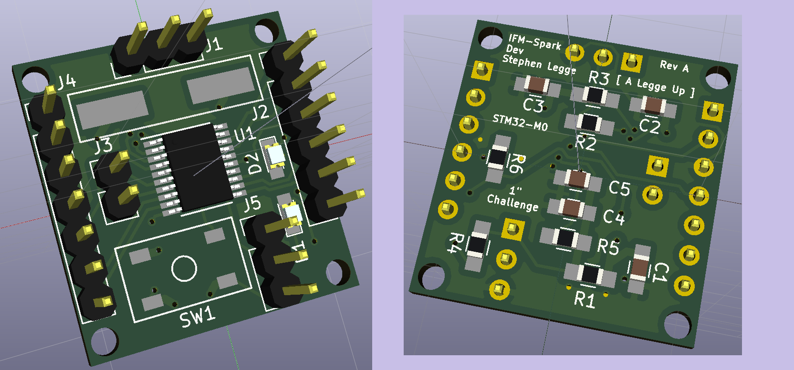

# IFM Spark Dev Board

What is it?
-----------

This is an example project that uses Gradle to build and test an embedded application.
It uses the examples included with the CppUTest project to show how it would work, the
embedded application doesn't do anything other than contain the objects to test.

Contributors
------------

* [Stephen Legge](https://github.com/slegge)

System requirements
-------------------

Gradle requires Java, but with the included gradlew that should be all that is needed
to build the firmware image.  This project as part of its initialization should pull
down the toolchain needed to build the firmware image.

For each operating system the requirements are similar, generally a Gcc or Clang
toolchain needs to be available for Gradle to use to build the tests.

In Windows, a standard install of Cygwin with gcc toolchain has been tested.

In Mac OS X, a default install of Xcode provides the Clang toolchain.

In Linux, standard gcc/g++ devel packages usually work fine.

Building
--------

If you have Gradle 3.0+ installed, you can just use

`gradle clean build`

or to use the bundled gradlew (Gradle Wrapper) use:

`./gradlew clean build`

Executing
---------

The Gradle build will create the firmware image and the CppUTest unit test runner.
The firmware image is meant to be loaded on the hardware, you'll need to load it
onto the hardware manually.  With an mbed board like a Nucleo board, it is just a
matter of copying the image to the mass storage device.

The CppUTest unit test runner is called utestrunner located under build/utestrunner/...

# License

This work is licensed under the Creative Commons Attribution 4.0 International License. To view a copy of this license, visit http://creativecommons.org/licenses/by/4.0/ or send a
letter to Creative Commons, PO Box 1866, Mountain View, CA 94042, USA.

Disclaimer
----------

THIS SOFTWARE IS PROVIDED BY THE COPYRIGHT HOLDERS AND CONTRIBUTORS "AS IS"
AND ANY EXPRESS OR IMPLIED WARRANTIES, INCLUDING, BUT NOT LIMITED TO, THE
IMPLIED WARRANTIES OF MERCHANTABILITY AND FITNESS FOR A PARTICULAR PURPOSE
ARE DISCLAIMED. IN NO EVENT SHALL THE COPYRIGHT OWNER OR CONTRIBUTORS BE
LIABLE FOR ANY DIRECT, INDIRECT, INCIDENTAL, SPECIAL, EXEMPLARY, OR
CONSEQUENTIAL DAMAGES (INCLUDING, BUT NOT LIMITED TO, PROCUREMENT OF
SUBSTITUTE GOODS OR SERVICES; LOSS OF USE, DATA, OR PROFITS; OR BUSINESS
INTERRUPTION) HOWEVER CAUSED AND ON ANY THEORY OF LIABILITY, WHETHER IN
CONTRACT, STRICT LIABILITY, OR TORT (INCLUDING NEGLIGENCE OR OTHERWISE)
ARISING IN ANY WAY OUT OF THE USE OF THIS SOFTWARE, EVEN IF ADVISED OF THE
POSSIBILITY OF SUCH DAMAGE.
